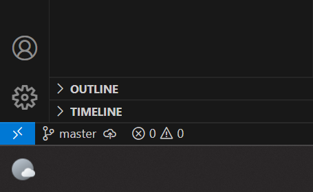
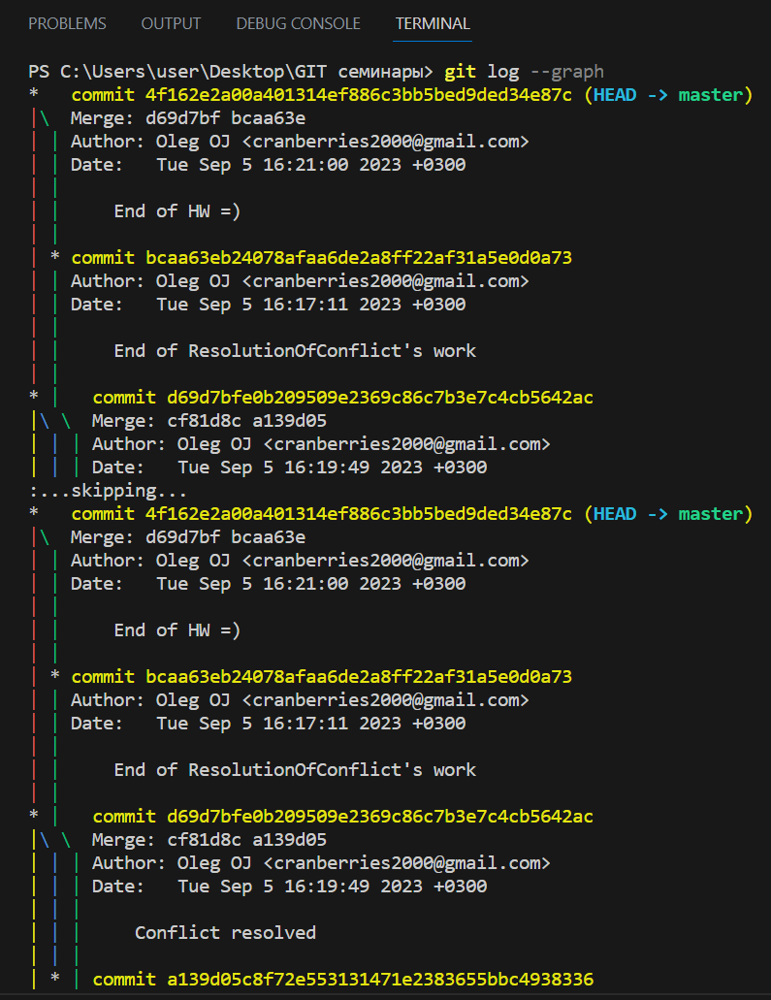
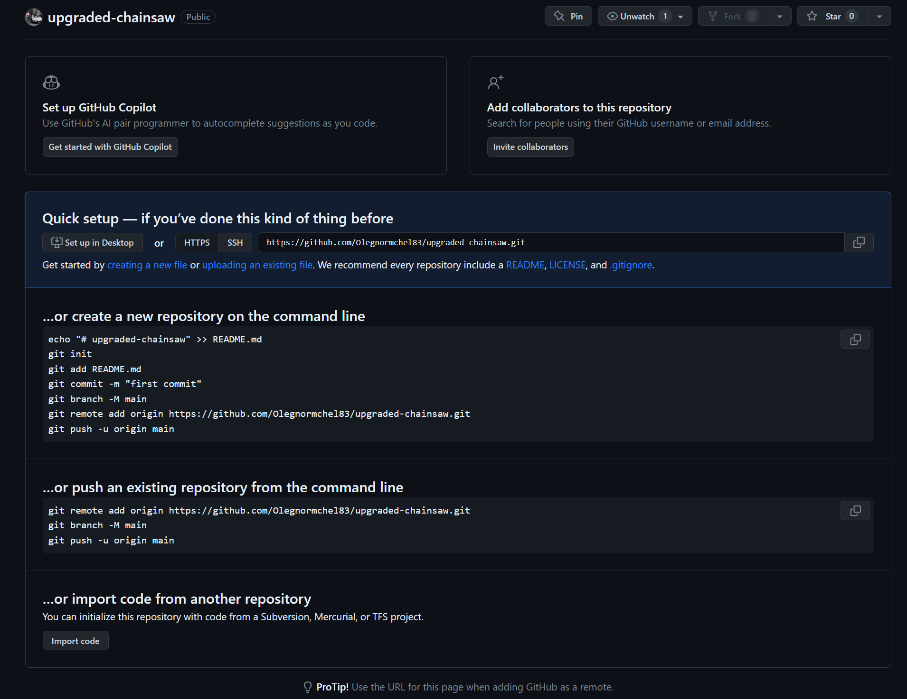
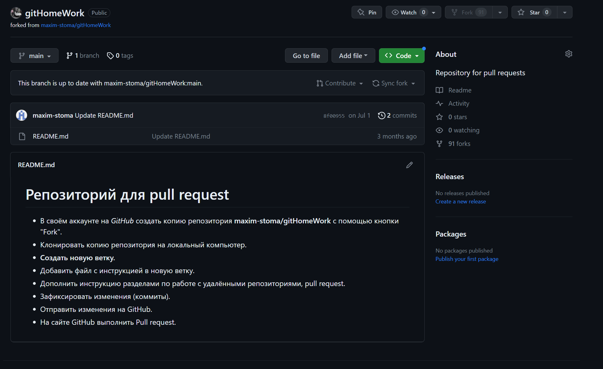

# Инструкция по установке Git для Windows.

## Скачивание и установка

1. Переходим на [официальный сайт git](https://git-scm.com/download/win/) и загружаем установщик, в соответствие с bit'ностью своей системы. 

2. Открываем установщик. Далее нам понадобится выбрать компоненты. Ставим галку только в верхнее окошко - "Создать иконку на рабочем столе"

3. Идем далее. Теперь нужно выбрать текстовый редактор, который будет использовать Git. По умолчанию это Vim, но мы ставим VS Code. 

4. Остальные галки оставляем как есть, ничего не меняем. 

Поздравляю, теперь у нас есть правильно настроенный Git! 

# Работа с git и VS Code

## Первые шаги

Надеюсь, что вы заранее подготовились, и у вас на компьюетере уже установлена программа VS Code.

Далее нам нужно создать папку на рабочем столе, в которой будет храниться наш проект, отслеживаемый git'ом. 

Запускаем VS Code. Во вкладке "File" жмем строку "Open folder" и выбираем папку, которую мы только что создали. Она должна отобразиться в окне "Explorer". Жмем ПКМ по пустой области в окне "Explorer" и выбираем "New file". Дадим ему название например "GettingToKnowGit.md". Расширение ".md" означает, что мы сможем работать в нашей программе с использованием языка "Markdown". 

    Markdown - это простой язык разметки, используемый для создания форматированного текста с помощью текстового редактора. 

# Синтаксис языка Markdown и команды git

## Основные команды git

Итак, мы создали наш первый файл, но git пока что его не отслеживает. Для того, чтобы git начал отслеживание нашего файла, его необходимо прежде всего инициализировать следующей командой: 

    git init

Для этого открываем терминал сочетанием клавищ "Ctrl + `" Отлично, git инициализирован, но пока все еще не отслеживает наш файл. Почему так? Потому что мы пока еще не сказали ему, какой именно файл ему нужно отслеживать. Проверить это можно командой: 

    git status

Git сообщит нам информацию о том

1. В какой папке мы находимся в данный момент
2. Обозначит неотслеживаемые файлы, расположенные в этой папке

Так вот, как же направить git на отслеживание нашего файла? Нужно указать git'у на файл: 

    git add  

И после через пробел написать название нашего файла. 

>*Кстати, достаточно будет написать первые несколкьо симвовлов в названии файла и нажать Tab, а git сам догадается, какой файл вы имеете в виду*. 

Проверим командой "git status" текущее состояние git'а. Видим, что теперь git отслеживает наш файл, и его название отображается зеленым цветом.

>*Кстати, зеленым цветом название файла отображается так же и в окне "Explorer", помимо цвета, у файла еще есть марка в виде буквы "А". Это означает, что файл отслеживается git'ом и пока что в нем нет новых сохраненных изменений*

Итак, об изменениях файла и сохранениях. Прежде чем приступать к ним, необходимо, как бы странно это не звучало, познкомитсья с git'ом. Это нужно для того, чтобы потом git нам показывал, кто и в какое время и какие изменения внес в файл (полезная штука для работы в группе или компании).

Так вот, чтобы git в дальнейшем не ругался на нас, когда мы захотим сохранить изменения в проекте, ошибками типа "Эй, чувак, ты кто? Я тебя не знаю, поэтому не буду коммитить твой проект", нам необходимо прописать следующие команды:

    git config --global user.name "Ivan Ivanov"
    git config --global user.email "ivaivanov@example.com"

Представились git'у, идем дальше!

Напишем в первой строке нашего файла какое-нибудь предложение, например "Hello world!". Проверим командой "git status". Git говорит о том, что изменен файл. Огонь, только как нам не потерять изменения в нашем файле? Нужно заново прописать "git add (название файла)" и следом прописать команду:

    git commit -m "message" 

Команда Commit позволяет сохранить и прокомментировать изменение нашего файла. Напишем следующее: git commit -m "добавили строку в файл"

>*Для того, чтобы не писать 2 команды друг за другом, можно использовать коснтрукцию "git commit -am "message"". Эта конструкцию включает в себя функции add и commit. Однако ее действие распространяется на все файлы в текущей папке*

Итак, если мы хотим сохранить изменение для одного конкретного файла в папке, то мы используем команды "add" и "commit -m" по очереди. Если же хотим сохранить изменения в нескольих файлах, то пользуемся конструкцией "commit -am"

А что если мы хотим вернуться на одно или несколько сохранений назад? Для этого существует команда:

    git log

Она показывает всю историю сохранений (коммитов), а так же автора изменений в файлах. Также каждый коммит имеет свой уникальный идентификационный номер. Но зачем? По первым 4 символам идентификационного номера коммита можно к нему перейти. Простыми словами - восстановить файл, акутальный на момент создания коммита. С помощью команды: 

    git checkout 1234

1234 - это как раз первые 4 символа идентификационного номера коммита. Там могут храниться как буквы, так и цифры. Хорошо, допустим мы хотим вернуться к актуальному виду нашего файла, как нам это сделать? Для этой цели существует команда: 

    git checkout master

Она возвращает нас, грубо говоря, в настоящее. Если прыгая по коммитам, мы, можно сказать, перемещаемся по прошлому (прошлым версиям нашего файла), то команда "checkout master" возвращает нас в настоящее время. 

Окей, допустим мы хотим сравнить 2 версии одного файла, например более старую и актуальную. Для этого, находясь в master-файле нам необходимо прописать команду: 

    git diff 1234

1234 - так же как и в команде "checkout" - айдишник коммита, с которым мы хотим сравнить текущую версию нашего файла. 

Поздравляю, мы только что выучили основные команды git! 

Монжо сделать небольшой перерыв и приступать к изучению синтаксиса языка Markdown. 

## Синтаксис языка Markdown

Итак, за разметку текста в Markdown отвечают символы. Давайте по порядку разбираться.

### Заголовок

Символ "#" отвечает за величину заголовка. В языке Markdown заголовок имеет 6 уровней, и вот количество решеток равняется уровню заголовка. Например "#" - это заголовок 1 уровня (самый большой). "##" - это заголовк 2 уровня (чуть поменьше), и так далее. 

### Выделение текста

За выделение текста в языке Markdown отвечают следующие комбинации символов: 

* "*" с обеих сторон текста означает *курсив*
* "**" с обеих сторон текста означает **Полужирный текст**
* "***" с обеих сторрн текста означает ***Полужирный курсив***
* "~~" с обеих сторон текста означает ~~зачеркнутый текст~~

### Списки

На языке Markdown можно создавать 2 вида списков: нумерованные и ненумерованные. За создание ненумерованных списков отвечает символ "*" c левой стороны текста (между звездочкой и текстом обязательно должен быть пробел): 

* 1 пункт списка
* 2 пункт списка
* 3 пункт списка

Если же мы хотим нумерованный список, то нам пригодится такая конструкция как "1. " (опять же, после цифры с точкой необходим пробел):

1. 1 пункт списка
2. 2 пункт списка
3. 3 пункт списка

> *Интересный факт, Markdown пронумирует список по порядку, какие бы цифры мы ни вводили перед точкой. Например мы можем ввести строки:   
"1. qwerty"  
"1. qwerty2"  
"1. qwerty3"    Но Markdown покажет нам:    
"1. qwerty"  
"2. qwerty2"  
"3. qwerty3"*

### Выделение абзацев

Если мы хотим выделить абзац в рамку, нам подойдут для этого такие символы как табуляци и ">" 

    В первом случае текст будет выделен вот так

>А во втором случае текст будет выделен вот так

Поздравляю, теперь мы знаем основные команды git и как ими пользоваться, а также синтаксис языка Markdown.

Спасибо за внимание!)

# Работа в Git

## Работа с ветками 

Для удобства работы над проектом нескольких человек или даже компании из 100 и более девелоперов, в git предусмотрены ветки. По умолчанию мы находимся и работаем в ветке master (или main). В этом можно убедиться прописав команду:

    git branch

Тогда в терминале мы увидим слудеющую картину: 

Как мы видим, текущая ветка выделена зеленым цветом и значком (*). Так же мы можем увидеть список всех действующих веток в проекте, располоежнных в алфавитном порядке. 

>Кстати, информация о текущей ветке так же расположена и в левой нижней части VS Code   

Окей, а как же добавить ветку в наш проект? Для этого нужно прописать следующую команду: 

    git branch <название ветки>

Наличие нескольких веток в проекте помогает разбить задачи между разработчиками в команде. Например, один решает задачу по разработке интерфейса игры, другой - программирует кнопки, и так далее. Каждый работает в своей отдельной ветке, а затем  все ветки сливаются в главную, и получается полноценный готовый проект. Слияние веток осуществляется с помощью команды: 

    git merge <название ветки>

Однако тут стоит быть внимательнее, потому что "git merge" сливает указанную ветку в ту ветку, в которой в данный момент мы расположены. Поэтому если мы хотим слить все готовые и проверенные ветки в главную, нам предварительно необходимо оказаться в главной ветке и уже от туда обращаться к команде "git merge".

После того, как слияние веток прошло успешно, программа работает без ошибок, самое время удалять ветки. Для этого сущетсвует команда: 

    git branch -d <название ветки>

Данная команда позволяет удалить ветку, если ее содержимое уже слито куда-либо. Простыми словами - удаляет ветку без потерь. Однако если мы поработали во второстепенной ветке, но забыли слить ее в главную, и при этом захотели удалить второстепенную, то с помощью вышеуказанной команды у нас этого сделать не получится, так как гит предупредит нас мол "Эй, чувак, сначала слей второстепенную ветку куда-нибудь, а потом удаляй ее, иначе ты все ~~прое~~ потеряешь".  

Но все же иногда случаются ситуации, когда надо удалить ветку, учитывая потери в ней, для этой цели существует команда:

    git branch -D <название ветки>

Заглавная буква D означает, что мы сможем удалить ветку в любом случае, слита она с какой-то другой или нет. 

Для того, чтобы перемещавться по веткам в процессе работы над проектом, сущетсвует уже знакомая нам команда: 

    git checkout <название ветки>

С той лишь разницей, что в данном случае мы прописываем название ветки, а не коммита, как ранее. 

Кстати, о коммитах, мы их можем создавать и в ветках, и для этого нам потребуется прописать уже известную нам команду "git commit -m "message"". Затем, чтобы наглядно увидеть, когда кем и какие коммиты в каких ветках были созданы, нужно прописать команду: 

    git log --graph 

Тогда в терминале мы увидим следующую картину: 

## Работа с изображениями

Часто бывает так, что мы хотим добавить изображение к нашему тексту. Для этой цели существует конструкция 
    
    ! [] () 
где в квадратных скобках чаще всего указывается **[название изображения]**, а в круглых **(ссылка на изображение)**. Ссылка на изображение указывается в формате *(картинка.jpg)*.
Таким образом мы можем добавить картинку 

Обратите внимание! Если картинка лежит в отдельной папке в репозитории, то ссылку на картинку необходимо указывать с учетом папки, например вот так: (Pictures/<название изображения>.jpg)

Если ошибиться в написании ссылки на изображение, то оно отобразиться "битым". 

Битые изображения отображаются следующим образом: 

Krolik.jpg - это подпись изображения в квадратных скобках.

>Кстати, рекомендуют прописывать в квадратных скобках название изображения с его расширением для того, чтобы было проще сориентироваться где какое изображение было потеряно в результате чего-либо. 

## Работа с ссылками

Добавить ссылку к своему тексту можно несколькими способами: 

1. Просто вставить ссылку на сайт - https://www.google.ru
2. Подписать ссылку своим текстом и сделать его кликабельным - [Как-то так](https://www.google.ru)

Во 2 случае используем контрукцию: 

    

где в квадратных скобках пишем [любой текст], а в круглые скобки кидаем (ссылку). Так же на подпись ссылки в квадратных скобках распространяются все возможности редактоирования текста с помощью языка Markdown, то есть мы можем прописать ссылку, например, на тот же гугл [*курсивом*](https://www.google.ru), [**полужирным**](https://www.google.ru) и так далее. [~~а вот сюда не нажимай~~](https://ru.wikipedia.org/wiki/Любопытство)

## Разрешение конфликтов
Конлифкты возникают в том случае, когда мы хотим слить, например, второстепенную ветку с главной, а у нас и там и там на одном и том же месте, предположим, задача решена разными способами.

В таком случае мы увидим следующее: 

Гит показывает нам 2 варианта, например, решения одной и той же задачи. Сверху на зеленом фоне выделены изменения, которые уже были в мастере на момент слияния, а ниже на синем фоне отображены входящие изменения. Так же сверху он предлагает нам 4 варианта решения данного (да и в целом любого) конфликта. Давайте же с ними разберемся. 

1. **Accept Current Change** - оставляет текущие изменения, которые уже были в главной ветке на момент слияния (принимает зеленый фон, а от синего отказывается)
2. **Accept Incoming Change** - принимает входящие изменения (берем синий фон, отказываемся от зеленого)
3. **Accept Both Changes** - оставляет оба изменения (берем оба фона)
4. **Compare Changes** - исходя из названия, позволяет сравнить изменения, однако этой кнопкой почти никто не пользуется (:

Благодарю за внимание!)

## Работа с удаленными репозиториями 

### Создание профиля на GitHub 

Профиль на GitHub необходим для работы с удаленными репозиториями. Под "удаленными" понимаются репозитории, находящиеся не на нашем компьютере. Так вот, заходим на [GitHub](https://github.com) и проходим регистрацию. 

После того, как мы зарегистрирвоались самое время создать наш первый удаленный репозиторий. Для этого справа сверху жмем на свой профиль, и в выпадающем меню выбираем "You repositories".

Затем жмем на зеленую кнопочку "New" и попадаем на страницу создания удаленного репозитория. Что же здесь происходит?

* __Repository name__ - название нашего удаленного репозитория, можно придумать свое, а можно воспользоваться предложенным (чуть ниже поля зеленым текстом выделенно предложенное название)
* __Description__ - описание удаленного репозитория (заполняется по желанию)
* __Public/Private__ - доступность репозитория. Приватные, как правило, запароленны

Так же приветсвуется добавление __README__ файла с описанием нашего проекта для того, чтобы посетители нашего репозитория смогли быстро ознакомиться с нашим проектом, а возможно даже помочь в разработке. 
Добавлять файл __.gitignore__ по желанию.
Ну а __выбор лицензии__ оставим на попозже, сейчас это нам не пригодится. 
Нажимаем кнопку "Create Repository"

Поздравляю! Теперь у нас есть профиль на GitHub и удаленный репозиторий. Продолжим в следующей главе. 

### Авторизация Git для работы с удаленным репозиторием и загрузка проекта в GitHub 

Итак, после создания удаленного репозитория мы видим перед собой следующее: 

На Quick setup не обращаем внимания, так как нас интересуют 2 серых окошка. Что же в них происходит? В двух словах - авторизация гита.
Если более подробно, то:

* В первом случае мы инициализируем git, добавляем README файл, о котором уже говорилось выше, создаем первый коммит. Далее переименовываем ветку _master_ в ветку _main_ (как-то раз в компании посчитали, что main выглядит более политкорректно и информативно). Следующей командой "git remote add origin..." мы как раз таки авторизуем git для работы с удаленным репозиторием. Проще говоря, мы сообщаем гиту точный адрес в сети, куда в дальнейшем будем отправлять все версии нашего проекта. И последующей командой "git push -u origin main" мы кидаем наш первый коммит в ветке main в удаленный репозиторий. 

* Во втором случае происходит все то же самое, с той лишь разницей, что отсуствует создание README файла, и ветка master переименовывается в main после авторизации гита. 

Подытожим: 

Команда 

    git branch -M

Позволяет нам переименовать ветку.

    git remote add origin...

указывает гиту адрес удаленного репозитория в сети.

    git push

отправляет наш проект на удаленный репозиторий. Но тут стоит быть внимательнее: прежде чем использвовать команду "git push" необходиммо все закоммитить командой "git commit -m "message"". 

>Кстати иногда можно встретиться с такой ситуацией, что после команды "git push" git выдаст нам ошибку. Тут не стоит пугаться, нужно всего лишь последовать подсказки гита и прописать команду "git push" но только с небольшими нюансами. А с какими именно, познакомитесь на практике (:

### Загрузка проекта в GitHub и выгрузка проекта из GitHub

Итак, с загрузкой проекта в удаленный репозиторий мы познакомились. Самое время изучить обратную процедуру. Предположим, мы на GitHub внесли изменения в наш проект в нашем удаленном репозитории. Если мы хотим перенести изменения с GitHub себе на компьютер, нам понадобится команда:

    git pull... 

и через пробел указать ссылку на проект, который мы хотим перенести себе на компьютер. 

Окей, если мы работаем со своим проектом, все просто. Но что если мы захотим, например, скачать себе проект друга и внести в него какие-то правки? Тут уже посложнее.

1. Нам понадобится получить от друга ссылка на его удаленный репозиотрий, либо же найти на просторах гитхаба любой другой удаленный репозиторий. 

Здесь мы можем увидеть информацию о ветках и файлах. Так же ознакомиться с README файлом проекта.

2. Итак, чтобы мы могли вносить изменения в данный проект или чем-нибудь его дополнять, нам потребуется создать копию этого репозитория у себя в профиле. Для этой цели сущетсвует такая функций как "__fork__". Нажав на кнопку fork мы попадаем на страницу копирования репозитория, здесь мы так же можем дать ему свое название или оставить текущее. Идем далее. 

3. После того, как мы создали копию репозитория, нам необходимо скопировать ссылку на этот репозиторий и запуллить его в программу VS Code. Для этого в GitHub на странице скопированного репозитория нажимаем зеленую кнопку "Code" и копируем ссылку с протоколом HTTPS. 

4. Далее в терминале прописываем команду:

        git clone <link>

    Вместо "link" вставляем скопированную ссылку. Отлично, теперь у нас компьютере появился репозиторий нашего друга.

5. И теперь мы можем прокачать проект нашего друга. Кстати советую для этого создать отдельную ветку, чтобы наш друг смог слить наши фичи с телом своего проекта без затруднений. 

Однако прокаченный проект останется только в копии удаленного репозитория нашего друга у нас в профиле. А вот как предложить нашему другу внести наши изменения в его проект мы узнаем в следующей главе. 

### Pull request 